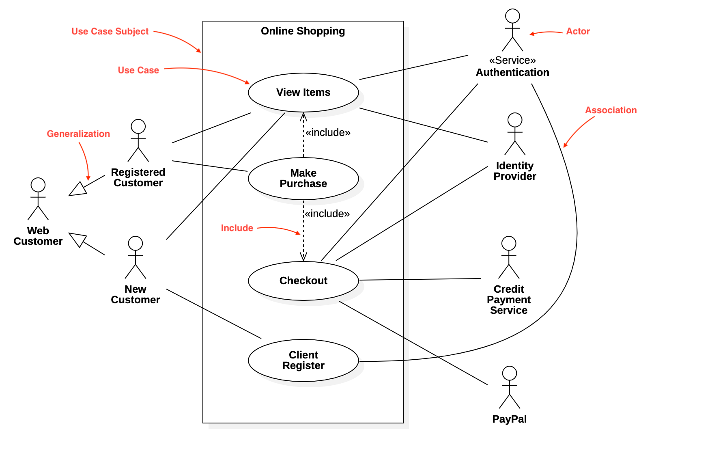

### Use Case Course *French Version*
#
Le diagram de cas d'utilisation se compose de 3 **Concepts de Base**
- **Cas d'utilisation** :
  - Modélisé par un cercle
  - Ensemble d'interactions entre un acteur et un système
  - Description de l'utilisation du système
- **Système** :
  - Modélisé par une boite noire
  - Contient des cas d'utilisations
- **Acteur** :
  - Modélisé par un bonhomme
  - Element externe actif qui interagit avec le système
  - n'est pas forcément un humain
> Exemple

